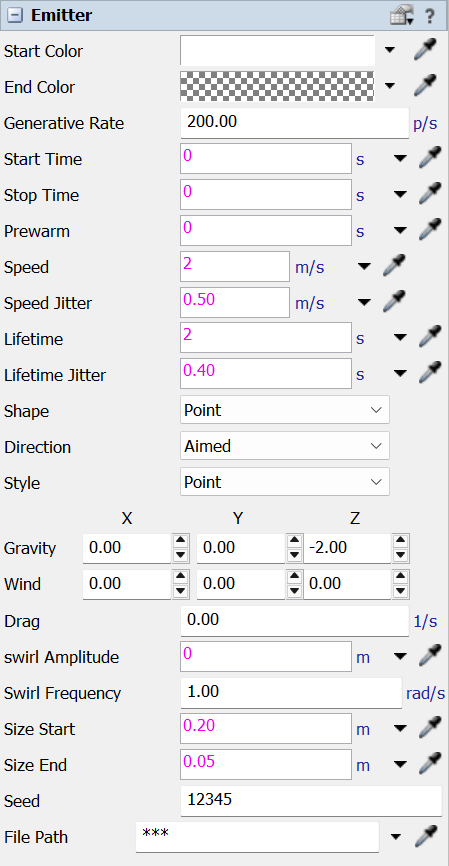

The Quick Properties for a [Particles.Emitter](../api/Particles.Emitter.md). Select an emitter in the 3D view and these fields appear in the Quick Properties pane. They describe one emitter's spec: when it emits, the region and direction particles launch from, how long they live, the forces acting on them, and how they look.

The emission region is sized by dragging the emitter's own resize handles in the 3D view; particle size is set by the Size Start / Size End fields. The fields below are listed in the order they appear on the panel; each links to the scripted property of the same emitter for the full definition.

## Fields

| Field | Description |
| --- | --- |
| [Start Color](../api/Particles.Emitter.md#startcolor) | Particle color and opacity at birth. |
| [End Color](../api/Particles.Emitter.md#endcolor) | Color and opacity each particle fades to by the end of its life. |
| [Generative Rate](../api/Particles.Emitter.md#rate) | Particles emitted per second. |
| [Start Time](../api/Particles.Emitter.md#starttime) | Model time emission begins (0 = at run start). Accepts a number or FlexScript. |
| [Stop Time](../api/Particles.Emitter.md#stoptimefield) | Model time emission ends (0 = never stops). Accepts a number or FlexScript. |
| [Prewarm](../api/Particles.Emitter.md#prewarm) | How far back to pre-simulate at reset so the cloud starts full instead of empty. |
| [Speed](../api/Particles.Emitter.md#speed) | Initial launch speed of each particle. |
| [Speed Jitter](../api/Particles.Emitter.md#speedjitter) | Random +/- variation added to each particle's launch speed. |
| [Lifetime](../api/Particles.Emitter.md#lifetime) | How long each particle lives before disappearing. |
| [Lifetime Jitter](../api/Particles.Emitter.md#lifetimejitter) | Random extra lifetime per particle. |
| [Shape](../api/Particles.Emitter.md#shapefield) | Shape of the emission region (Point, Line, Disk, Plane, Box, Sphere). |
| [Direction](../api/Particles.Emitter.md#directionfield) | Aimed launches in a cone along the arrow; Omni launches in all directions. |
| [Style](../api/Particles.Emitter.md#stylefield) | Draw particles as soft dots (Points) or as the emitter's own image (Sprite). |
| [Gravity](../api/Particles.Emitter.md#gravity) | Constant acceleration on every particle (e.g. Z = -9.8 for gravity). X / Y / Z. |
| [Wind](../api/Particles.Emitter.md#wind) | Extra constant acceleration added on top of gravity. X / Y / Z. |
| [Drag](../api/Particles.Emitter.md#drag) | Slows particles over time; higher values decay velocity faster. |
| [Swirl Amplitude](../api/Particles.Emitter.md#swirlamp) | Radius of a spiral wobble added to each particle's path (0 = none). |
| [Swirl Frequency](../api/Particles.Emitter.md#swirlfreq) | How fast the swirl spins. |
| [Size Start](../api/Particles.Emitter.md#sizestart) | Particle diameter at birth. |
| [Size End](../api/Particles.Emitter.md#sizeend) | Particle diameter at the end of its life. |
| [Seed](../api/Particles.Emitter.md#seedfield) | Random seed; change it to vary the random pattern. |
| File Path | Image used when Style is Sprite. Set it with the image picker or the Browse button; leave it empty to fall back to the built-in soft dot. |
| [Disabled](../api/Particles.Emitter.md#disabled) | Turn the emitter off: it produces no particles. The handle still shows so you can re-enable it. |

## Related

For these fields as scripted properties (with types, defaults, and code examples), see the [Particles.Emitter](../api/Particles.Emitter.md) API reference. The [Particle System Properties](system-panel.md) panel holds the model-wide display and level-of-detail settings.
