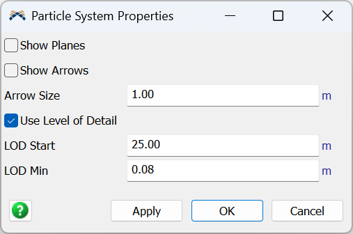

The properties panel for the model's single [Particles.System](../api/Particles.System.md). It opens when you double-click the **Particle System** in the Toolbox. The system is created automatically when you drop the first emitter, so you rarely need to open this panel.

Every setting here controls how emitters are *drawn*, not how the particles behave: the editing handles shown on each emitter and the distance-based level-of-detail thinning. Changing them never alters particle motion or appearance, only the picture in the 3D view.

## Settings

| Setting | Description |
| --- | --- |
| [Show Planes](../api/Particles.System.md#showplanes) | Show each emitter's region outline (the wireframe emission shape). |
| [Show Arrows](../api/Particles.System.md#showarrows) | Show each emitter's aim-direction arrow handle. |
| [Arrow Size](../api/Particles.System.md#arrowsize) | World size of the aim-arrow handles. Display only; it has no effect on particles. |
| [Use Level of Detail](../api/Particles.System.md#lod) | When on, far emitters emit fewer particles to cut draw cost. |
| [LOD Start](../api/Particles.System.md#lodstart) | Distance within which an emitter keeps full detail; thinning begins past it. |
| [LOD Min](../api/Particles.System.md#lodmin) | Lowest the thinning can go (0 to 1): how sparse a far emitter may get. |

## Related

For the same settings as scripted properties (plus the live-particle cap and the read-only performance stats), see the [Particles.System](../api/Particles.System.md) API reference.
